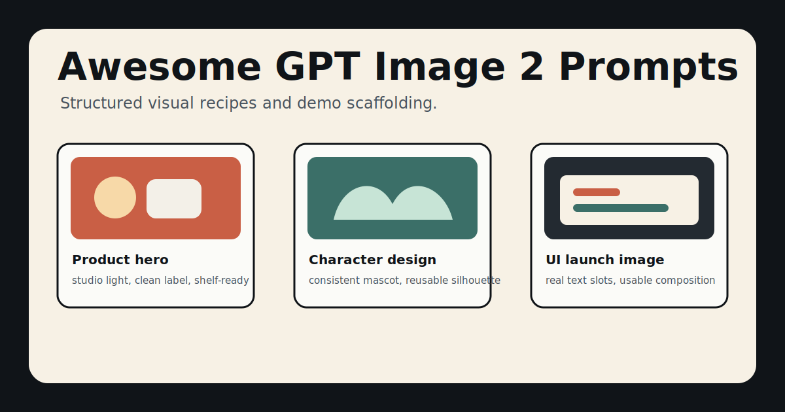
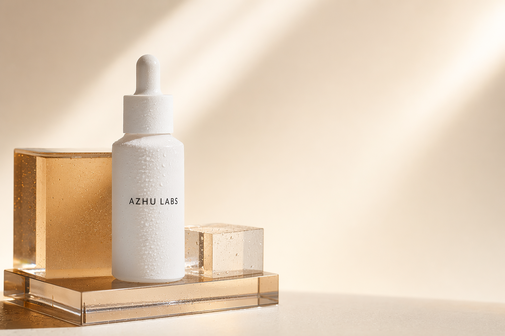

# Awesome GPT Image 2 Prompts

[](LICENSE)
[](README.zh-CN.md)

English | [中文](README.zh-CN.md)

Curated prompt patterns, visual recipes, and demo scaffolding for `gpt-image-2`.

This repository turns high-signal image prompting patterns into clean, copy-ready GPT Image 2 recipes with structured metadata and a local demo gallery.



## Why This Exists

Most prompt collections are long README dumps. They are useful for search, but hard to compare, filter, test, or turn into repeatable visual workflows.

This repo keeps prompts in structured JSON and renders a gallery so the collection stays easy to search, test, and extend.

## Gallery

The gallery pairs each recipe with a generated output image so the repository is useful at first glance, not just a prompt dump.



## Quick Browse

| Category | Use case | Example |
| --- | --- | --- |
| Product photography | E-commerce hero shots | Premium bottle on colored acrylic, realistic studio lighting |
| Character design | Consistent mascots | Friendly robot guide with reusable silhouette constraints |
| UI and brand | App store / launch visuals | SaaS dashboard hero image with real text placeholders |
| Editorial | Magazine and blog headers | Cinematic essay illustration with precise mood controls |
| Diagrams | Explainers and systems | Clean isometric workflow diagram with labeled steps |
| Image editing | Reference-based edits | Preserve product shape while changing scene, light, and props |

Browse the structured catalog:

- [catalog/prompts.json](catalog/prompts.json)
- [docs/research.md](docs/research.md)

Open the static demo gallery:

- [docs/index.html](docs/index.html)

## Generate A Demo Image

```bash
cd examples
npm run generate -- product-hero
npm run generate:all
```

The example script reads Azure/OpenAI-compatible settings from `.env` and writes generated images to `assets/generated/`.

## Prompt Card Format

Each prompt entry includes:

- `id`
- `title`
- `title_zh`
- `category`
- `model`
- `preview_image` (generated output path)
- `prompt`
- `prompt_zh`
- `recommended_settings`
- `tags`
- `notes`
- `notes_zh`

The public catalog contains original GPT Image 2 recipes written for this repository. Internal source research is maintained privately so this repo stays focused on AzhuTech's prompt library and demos.

## Roadmap

- Add 100 curated prompt recipes.
- Add category pages and search.
- Add before/after image-edit examples.
- Add prompt evaluation notes for text rendering, layout control, product fidelity, and character consistency.
- Add Chinese prompt variants.

## License

Prompt recipes in this repository are released under CC0-1.0 unless otherwise noted.
