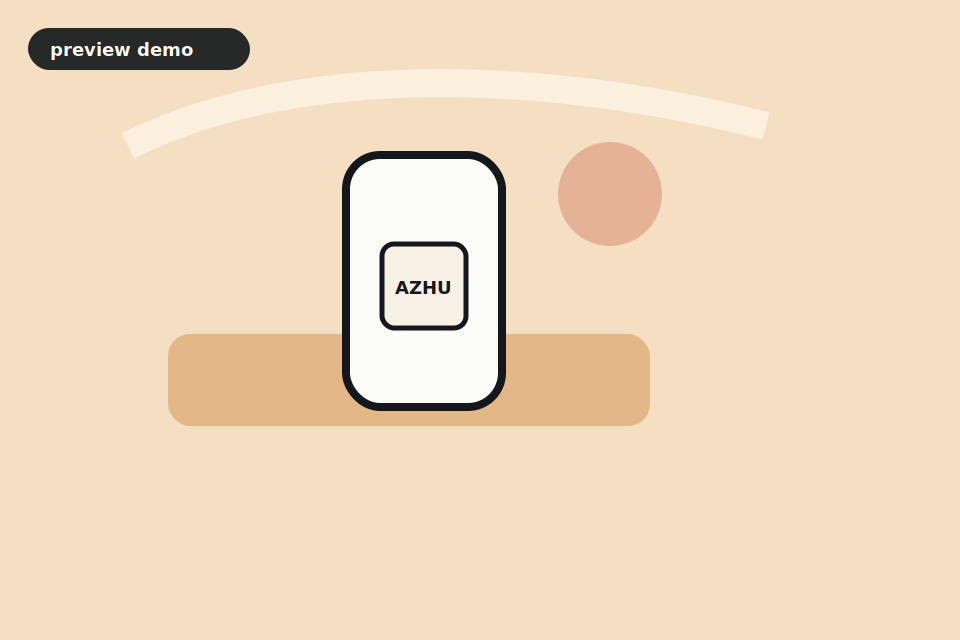

# Awesome GPT Image 2 Prompts

[](LICENSE)

[English](README.md) | 中文

面向 `gpt-image-2` 的高质量提示词模式、视觉配方和演示仓库。

本仓库会把高信号图像提示词模式整理为适合 GPT Image 2 的结构化 prompt recipes，并提供本地 gallery demo。


## 为什么做这个

多数提示词仓库只是很长的 README 列表，适合搜索，但不适合筛选、对比、测试和复用。

这个仓库会把提示词放进结构化 JSON，并渲染成 gallery，方便搜索、测试和扩展。

## Gallery 预览

当前 gallery 已经为每条 recipe 配置 preview artwork，让仓库第一眼不是纯文本。

> 这些 preview images 是手工构建的演示素材，不是 GPT Image 2 实际输出。配置 OpenAI API key 后，可以运行生成脚本创建真实输出图。



## 快速浏览

| 分类 | 场景 | 示例 |
| --- | --- | --- |
| Product photography | 电商产品图 | 彩色亚克力背景上的高端瓶身，真实棚拍光 |
| Character design | 角色设计 | 可复用轮廓的友好机器人导览角色 |
| UI and brand | App / SaaS 宣发图 | 带真实文字占位的 dashboard hero image |
| Editorial | 文章头图 | 带明确情绪和构图控制的杂志风插画 |
| Diagrams | 解释图 | 干净的等距工作流图和步骤标签 |
| Image editing | 参考图编辑 | 保留产品形状，同时替换场景、灯光和道具 |

结构化内容：

- [catalog/prompts.json](catalog/prompts.json)
- [docs/research.md](docs/research.md)

本地静态 gallery：

- [docs/index.html](docs/index.html)

## 生成演示图

```bash
cd examples
npm install
OPENAI_API_KEY=... npm run generate -- product-hero
```

示例脚本使用 OpenAI Images API 的 `gpt-image-2`，并把图片写入 `examples/out/`。

## Roadmap

- 收录 100 条高质量 prompt recipes。
- 为每条 prompt 补真实生成图。
- 增加分类页和搜索。
- 增加图片编辑 before/after 示例。
- 增加文字渲染、布局控制、产品保真、角色一致性的测试说明。
- 增加中文 prompt variants。

## License

除非特别说明，本仓库中的原创 prompt recipes 使用 CC0-1.0。
