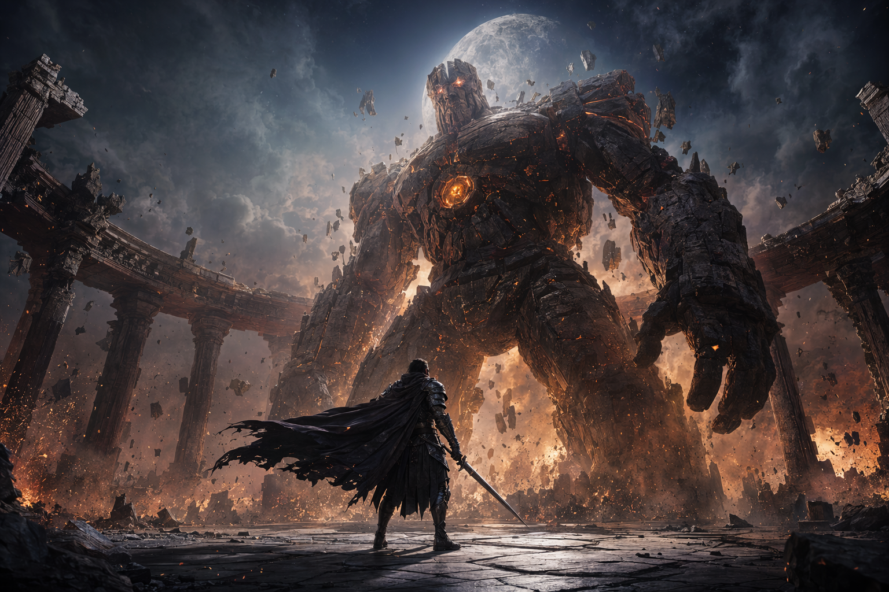

# Awesome GPT Image 2 Prompts

[](LICENSE)

[English](README.md) | 中文

面向 `gpt-image-2` 的视觉灵感库、真实生成图和轻量 gallery 演示仓库。

本仓库会把游戏、影视、人像、角色和商业视觉的画面配方整理为 GPT Image 2 结构化 prompt recipes，并提供真实生成图 gallery。


## 为什么做这个

多数提示词仓库只是很长的 README 列表，适合搜索，但不适合筛选、对比、测试和复用。

这个仓库会把提示词放进结构化 JSON，并渲染成 gallery，方便搜索、测试和扩展。

## Gallery

当前 gallery 已经为每条 recipe 配置实际生成图，让仓库第一眼就能判断 prompt 的视觉效果，而不是只看文字。



## 快速浏览

| 分类 | 场景 | 示例 |
| --- | --- | --- |
| Game art | 游戏关键图、封面、RPG 资产 | Boss 战场景、赛博武士封面、治愈系 RPG 村庄 |
| Anime character | 二次元角色立绘与卡牌 | 抽卡角色、机甲驾驶员、暗黑幻想卡牌 |
| Cinematic film | 电影感画面 | 霓虹黑色电影、太空歌剧、沙漠追逐帧 |
| Beauty photography | 高级人像摄影 | 黄金时刻、霓虹棚拍、复古胶片人像 |
| Commercial | 商业品牌视觉 | 产品主视觉、包装系统、SaaS 发布图 |
| Utility design | 可复用测试样张 | 吉祥物、图示、贴纸套装、建筑概念 |

结构化内容：

- [catalog/prompts.json](catalog/prompts.json)
- [docs/research.md](docs/research.md)

本地静态 gallery：

- [docs/index.html](docs/index.html)

## 生成演示图

```bash
cd examples
npm run generate -- product-hero
npm run generate:all
npm run generate:missing
```

示例脚本会读取 `.env` 中的 Azure/OpenAI-compatible 配置，并把图片写入 `assets/generated/`。

## Roadmap

- 收录 100 条高质量 prompt recipes。
- 增加分类页和搜索。
- 增加图片编辑 before/after 示例。
- 增加文字渲染、布局控制、产品保真、角色一致性的测试说明。
- 增加中文 prompt variants。

## License

除非特别说明，本仓库中的原创 prompt recipes 使用 CC0-1.0。
